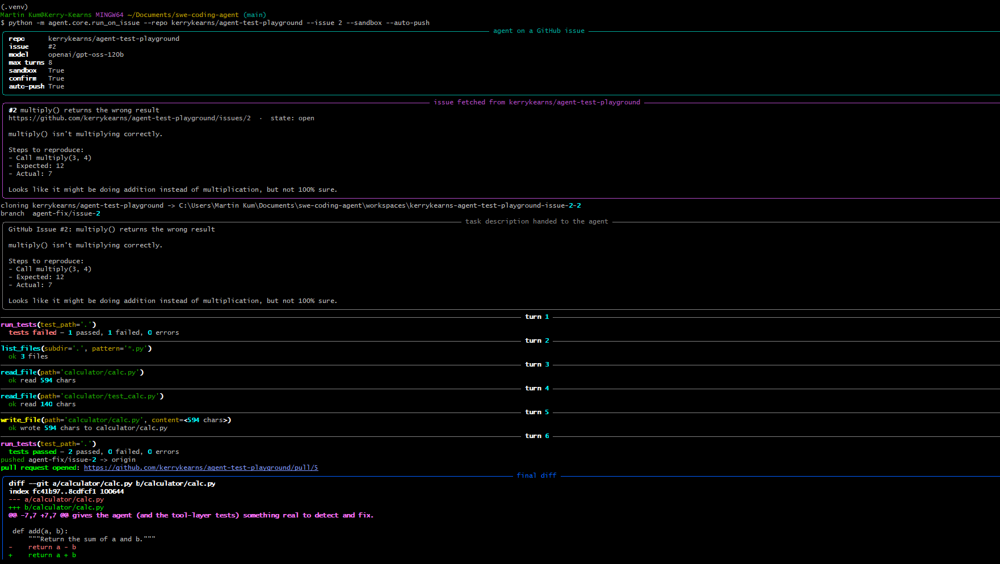
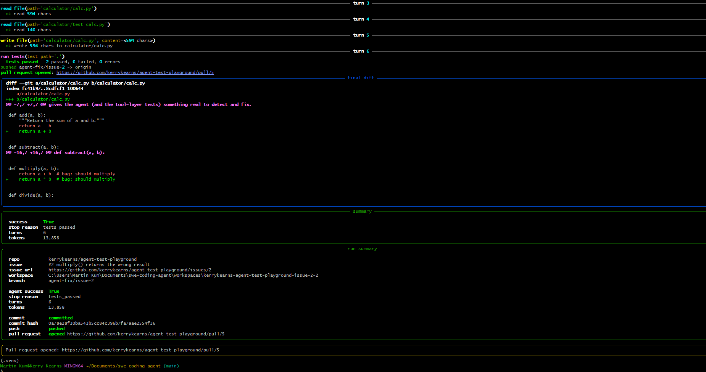
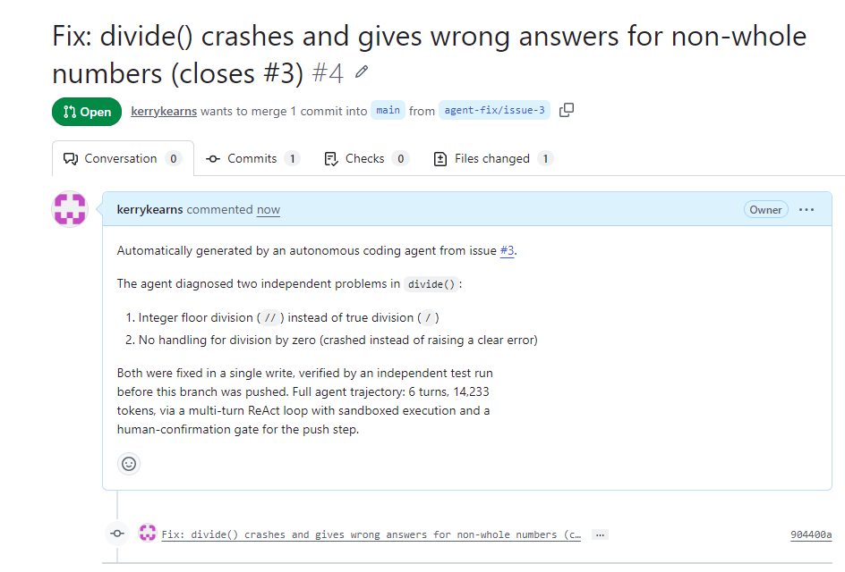
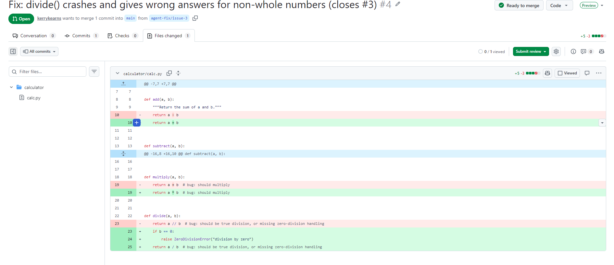
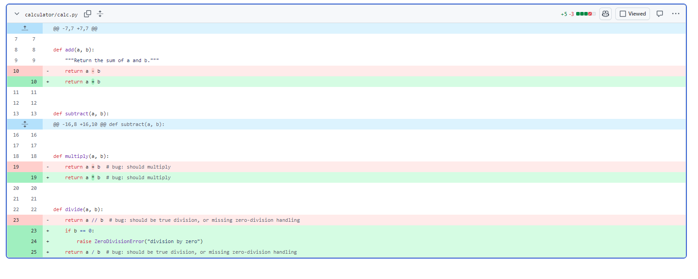
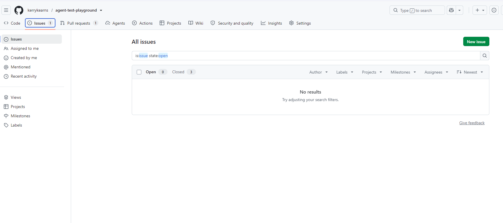
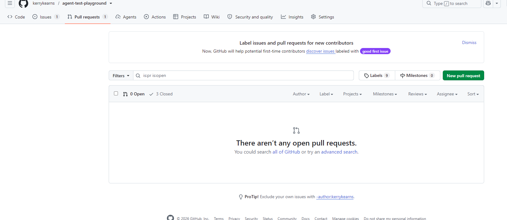

# swe-coding-agent

An autonomous, multi-turn coding agent: give it a GitHub issue and it fetches
the issue, clones the repo, reasons its way to a fix across multiple turns
(reading files, editing, running tests, adjusting), verifies the fix by
actually running the test suite, and — only after a human-confirmable safety
gate — pushes a branch and opens a pull request. All test execution happens
inside a network-isolated Docker sandbox. Everything it claims to have done
is independently re-verified rather than taken on the agent's word.

## Key Result

> On a 10-task evaluation spanning three difficulty tiers, the single-shot
> baseline and multi-turn ReAct agent were tied on trivial and
> medium-difficulty bugs (100% success, both conditions). On hard-tier tasks
> — each containing two independent defects in a single function — baseline
> succeeded on 3 of 4 (75%), while the ReAct agent succeeded on all 4 (100%).
> In every case, the ReAct agent's win came from catching a secondary defect
> (e.g., missing input validation) that the baseline's one-shot fix missed
> while addressing the primary bug correctly. This came at a substantial
> cost: react used ~18.3x more tokens and ~36x more wall-clock time per task
> on average. Overall, these results suggest multi-turn iteration's value
> concentrates specifically on tasks with multiple independent failure
> modes, at a cost that may not be justified for simpler bugs — a real
> tradeoff any production deployment of an agentic coding system would need
> to weigh.

Full numbers: [eval/results/report.md](eval/results/report.md).

## Architecture

| Component | What it does | Source |
|---|---|---|
| Tool layer | Workspace-contained file ops (`read_file`, `write_file`, `list_files`, `search_text`), diff extraction, and a pinned-interpreter pytest runner. Every tool resolves paths through `Workspace`, which rejects anything that escapes the repo root. | [agent/tools/](agent/tools/) |
| ReAct loop | The multi-turn agent: act → observe → adjust → repeat, until the tests genuinely pass, the agent calls `finish`, or the turn budget runs out. Six tools, no raw shell. | [agent/core/react_agent.py](agent/core/react_agent.py) |
| Baseline agent | The single-shot comparison point: one LLM call, one diff, no iteration — the floor the ReAct loop is measured against. | [agent/core/baseline.py](agent/core/baseline.py) |
| GitHub integration | Fetches an issue, clones the repo, formats the issue as a task, commits locally, and — once approved — pushes and opens a PR. | [agent/core/github_client.py](agent/core/github_client.py), [repo_manager.py](agent/core/repo_manager.py), [run_on_issue.py](agent/core/run_on_issue.py) |
| Safety gate | A config-driven risk classifier (`configs/safety_policy.yaml`) plus a confirmation gate that sits in front of every tool call in interactive runs, and specifically in front of the push/PR step in automated runs. Unclassified tools fail safe to "ask," never "allow." | [agent/safety/](agent/safety/) |
| Sandbox | Docker containers with `network_mode="none"`, resource limits, and a hard timeout for every test run, so the agent's only executable action (pytest) never touches the host or the network. | [agent/tools/sandbox.py](agent/tools/sandbox.py), [Dockerfile.sandbox](Dockerfile.sandbox) |
| Memory | Redis-backed trajectory storage with semantic (embedding) similarity search, so a new run can be told about a similar past run before it starts — plus a heuristic credit-assignment scorer over each trajectory's `run_tests` checkpoints. | [agent/memory/](agent/memory/) |
| Eval harness | Runs the baseline and the ReAct agent over the same curated, difficulty-tiered task set, independently re-verifies success against each task's own `verify_command`, and reports success rate / turns / tokens / wall-clock by condition and difficulty. | [eval/](eval/) |

## How it works

An end-to-end run against a real GitHub issue, in one command:

```
python -m agent.core.run_on_issue --repo kerrykearns/agent-test-playground --issue 2 --sandbox --auto-push
```


*The agent fetches issue #2 from GitHub, clones the repo, and starts its ReAct loop — reading files, then writing a fix.*


*Six turns later the tests pass, the fix is pushed, and a pull request is opened automatically — no further commands needed.*


*The agent-authored PR description: what it diagnosed, what it changed, and how it verified the fix.*


*The actual code diff the agent produced, opened as a normal GitHub PR review.*


*A closer look at the same diff — two independent bugs (add, multiply) fixed in one pass.*


*Three real issues in the test playground repo, each closed by an agent-authored PR.*


*The corresponding three pull requests, all opened and merged without hand-written code.*

## Setup

```bash
python -m venv .venv
source .venv/bin/activate        # .venv\Scripts\activate on Windows
pip install -r requirements.txt
```

Copy [.env.example](.env.example) to `.env` and fill in:
- `GROQ_API_KEY`, `GROQ_BASE_URL`, `GROQ_MODEL` — LLM provider (Groq, OpenAI-compatible client)
- `GITHUB_TOKEN`, `GITHUB_TEST_REPO` — fine-grained PAT with `repo` scope, for issue fetch / clone / push / PR
- `REDIS_HOST`, `REDIS_PORT` — only needed for `--memory`

Build the sandbox image once (requires Docker Desktop or another Docker daemon running):

```bash
python -c "from agent.tools import build_sandbox_image; build_sandbox_image()"
```

Redis (only needed for trajectory memory, `--memory`):

```bash
docker run -d --name swe-agent-redis -p 6379:6379 redis:latest
```

Run the agent:

```bash
# Fast local iteration against a fixture on disk
python -m agent.core.react_agent --repo demo/sample_repos/calculator --task "fix add() so it returns the correct sum" --max-turns 8

# End to end against a real GitHub issue: fetch, clone, iterate, commit, push, PR
python -m agent.core.run_on_issue --repo <owner>/<repo> --issue <n> --sandbox --auto-push
```

Run the evaluation harness:

```bash
python -m eval.run_eval --conditions baseline,react   # resumable: re-running skips completed (task, condition) pairs
python -m eval.report                                  # aggregates eval/results/*.json into eval/results/report.md
```

## Design decisions & tradeoffs

- **Verified, not claimed.** Neither the baseline's `success` field nor the ReAct loop's `final_success` is ever taken on faith — both are set only when a `run_tests` observation actually reported a pass, and the eval harness re-derives success a third time, from scratch, by independently re-running each task's `verify_command`. A model asserting `finish(success=True)` without having seen tests pass is recorded as a false claim, not a success.
- **Layered safety, not one gate.** The Docker sandbox (network isolation, resource limits, execution timeout) and the confirmation gate (config-driven risk classification, human approval before push/PR) are deliberately separate layers with different threat models — the sandbox contains what a command *can* touch, the gate decides what a human has *approved*. An unclassified tool fails safe to "ask," never "allow."
- **The Groq model went away mid-project, and nothing had to change but a config value.** `llama-3.3-70b-versatile` — the project's default model throughout M1–M7 — was deprecated by Groq partway through the M8 evaluation run. Because the model is read from `GROQ_MODEL` at call time (never hard-coded), the fix was pointing the environment variable at `openai/gpt-oss-120b` and re-running; no code changed. The M9 demo screenshots below already reflect that switch.
- **A live run hit a genuinely non-deterministic failure, and the safety design absorbed it rather than papering over it.** During the M9 demo, an early attempt on issue #2 had the model write diff-syntax characters (`+-`, `++`) directly into `calc.py`'s content instead of plain Python, producing a collection error on the next test run. The agent tried to recover but ran out of its 8-turn budget before rewriting the file cleanly. Nothing was committed or pushed — the run simply never reached a passing test, and "verified, not claimed" means a passing test is the only thing that advances the loop toward a commit. A retry on the same issue succeeded cleanly in 6 turns.
- **The M8 eval run had to survive a multi-day rate limit, so it was built to resume, not to be babysat.** Groq's free tier is 100k tokens/day and a single ReAct run costs ~15-30k, so a 10-task × 2-condition matrix cannot finish in one sitting. `eval.run_eval` writes each `(task, condition)` result to disk immediately after it completes and skips any pair whose result file already exists, so a 429 mid-run costs at most the run in progress — re-running the same command the next day picks up exactly where it left off.
- **A write never auto-triggers a test run, but a passing test run always ends the loop immediately.** The asymmetry is deliberate: whether the agent remembers to verify its own work is a real eval signal worth measuring, not something to quietly automate away — but once tests genuinely pass there is nothing left to learn from another turn.
- **The agent doesn't commit its own tooling's side effects.** Running pytest inside a checkout leaves `__pycache__`/`.pytest_cache` behind; these are excluded via `.git/info/exclude` (never the target repo's own `.gitignore`, which would itself become an unrequested diff) so a reviewer's PR never contains bytecode caches the agent incidentally produced while verifying its own fix.
- **Every commit message goes through `git commit -F <file>`, never `-m`.** Commit messages are built from GitHub issue titles — text from a stranger — and `run_command` uses `shell=True`, so interpolating that text onto a command line would be a shell-injection vector. A test commits a title containing `& echo pwned > pwned.txt` and asserts no such file appears.

## Limitations & future work

- **Credit assignment is a heuristic, not RL.** `agent/memory/credit_assignment.py` scores turns by whether the failure count moved down/up/flat between consecutive `run_tests` checkpoints — auditable by reading the code, but not a trained reward model or a policy-gradient signal.
- **Memory on/off comparison was descoped from M8.** The eval harness measures baseline vs. ReAct; it does not yet measure whether Redis-backed trajectory memory changes success rate, turns, or cost. The M7 demo showed a real memory match injected into a live run, but that is a single anecdote, not an evaluated effect.
- **The safety policy is regex/pattern matching on tool names and arguments, not a parser.** `configs/safety_policy.yaml` is explicit that this is a good-faith net for an agent on a legitimate task, not a boundary hardened against deliberately obfuscated input — it has known syntactic gaps a determined adversarial string could slip through. That threat model is the sandbox's job (process/network isolation), not the classifier's.
- **The eval sample is small.** 10 tasks across 3 difficulty tiers is enough to see a directional signal (hard-tier tasks favor iteration) but not enough for a statistically robust claim — see `eval/results/report.md`'s own methodology note.
- **The project depends on a free-tier model that can and did change under it.** `llama-3.3-70b-versatile`'s deprecation mid-project (see Design decisions above) was absorbed this time by a one-line config change, but it demonstrates a real dependency risk for anything built against a free/rotating model tier.
- **Malformed model output is a live, non-deterministic failure mode.** Both the M3 escaped-newline incident and the M9 diff-syntax-corruption incident (see above) came from the same underlying risk: nothing guarantees a model emits syntactically valid source on every turn. The current mitigations (heuristic detection, a bounded turn budget, "verified not claimed" gating the loop's exit) contain the damage — they don't eliminate the possibility, and a retry can still be needed.

## Tech stack

Python 3.10+ · [Microsoft Agent Framework](https://github.com/microsoft/agent-framework) (tool schema declaration) · Groq (LLM inference, OpenAI-compatible client) · PyGithub · Docker SDK for Python · Redis + `fakeredis` (tests) · `sentence-transformers` (all-MiniLM-L6-v2, trajectory similarity) · Pydantic · PyYAML · pytest + pytest-cov · Typer + Rich (CLIs) · `tiktoken` (token accounting)
